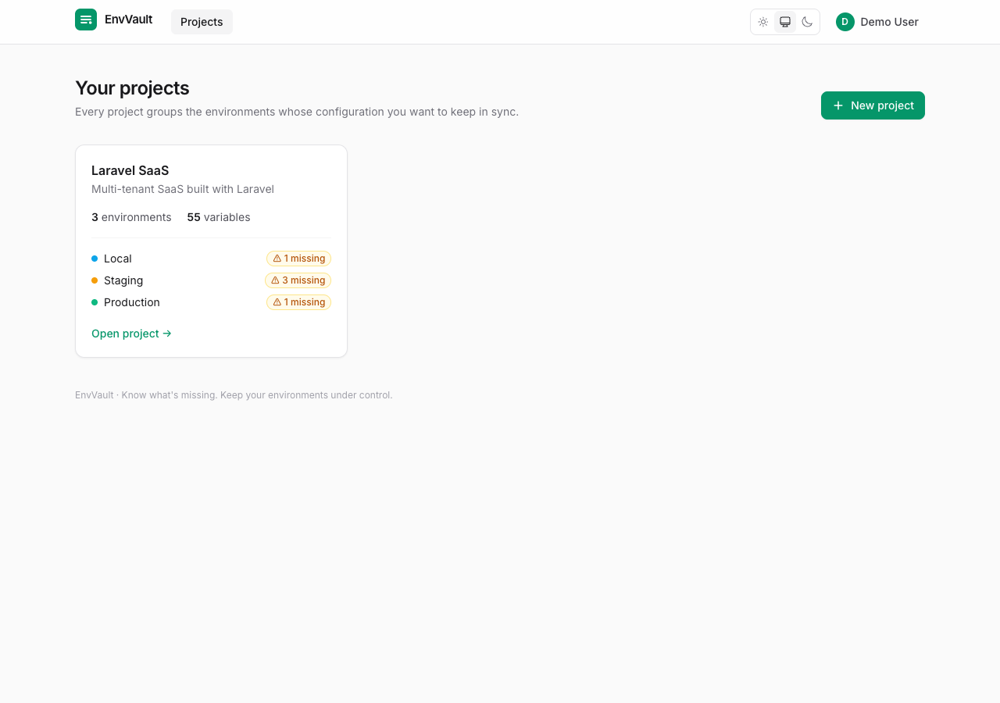
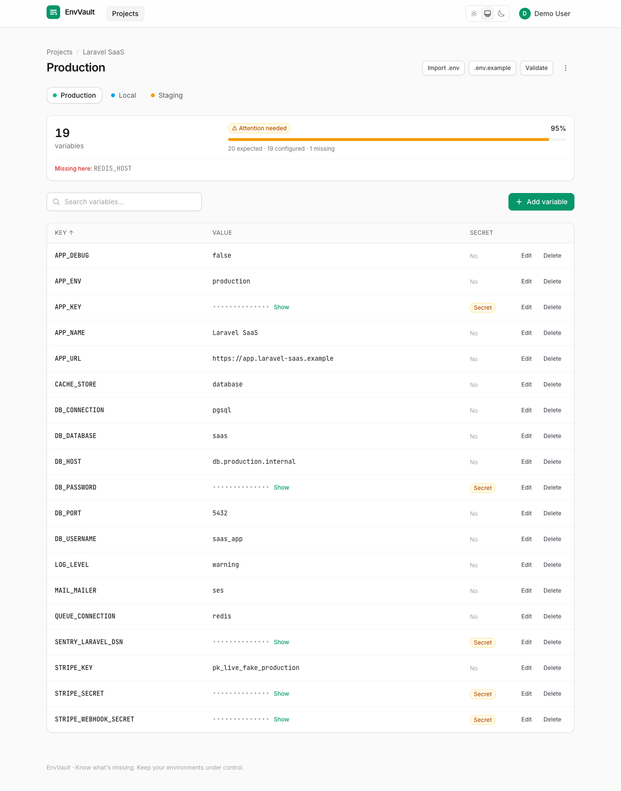
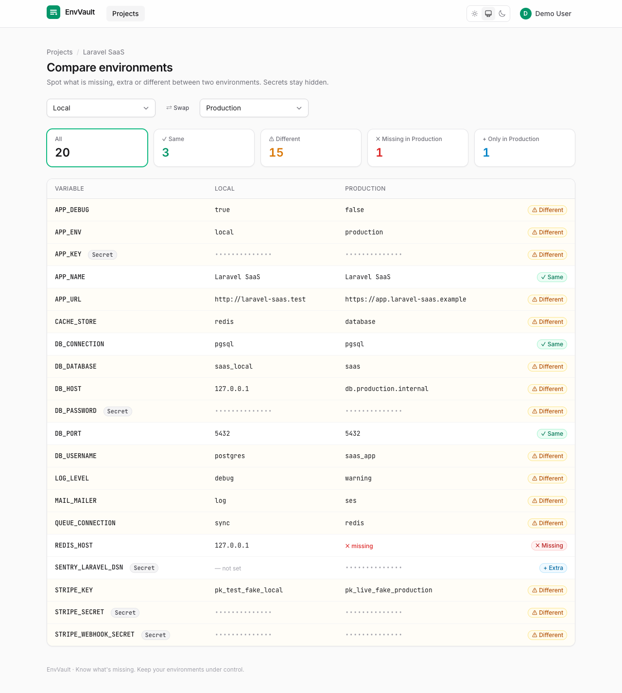
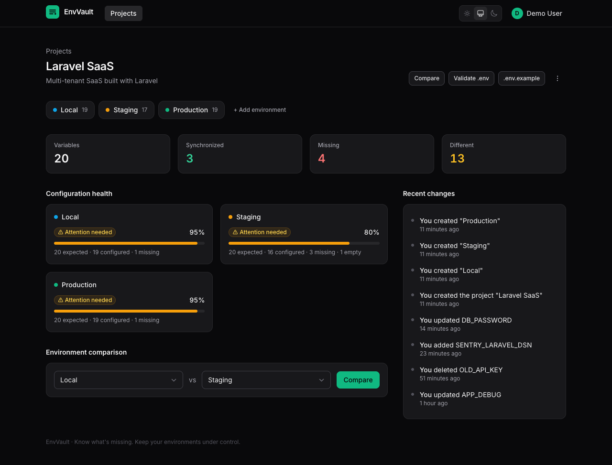
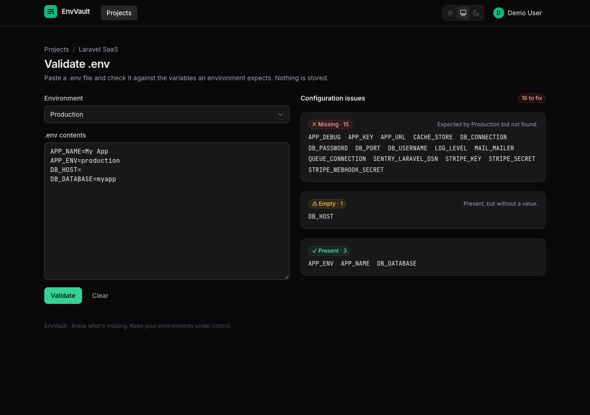
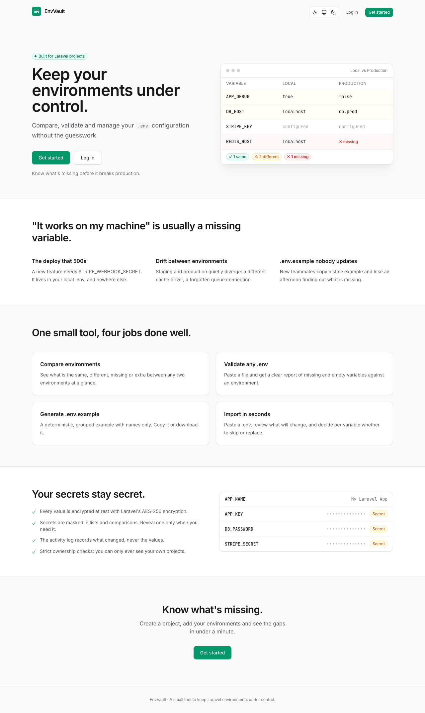

# EnvVault

> Know what's missing. Keep your environments under control.

EnvVault is a small, focused tool for Laravel developers to **manage, compare and validate `.env` configuration** across environments. Create a project, add Local / Staging / Production, and instantly see which variables are missing, extra or different, without ever exposing a secret by accident.

It is deliberately *not* an enterprise secrets manager. It solves one concrete problem well, and it is built to show good Laravel practice: authorization, encryption, testing and a polished UI.



## Features

- **Projects and environments**: one project holds as many environments as you need (Local, Staging, Production…), each with its own colour.
- **Variable management**: add, edit, delete, live search, sort by key, pagination, copy to clipboard.
- **Secrets done carefully**: secret values are masked everywhere, revealed on demand (and auto-hidden after 15 seconds), and stored encrypted.
- **Environment comparison**: pick any two environments and get **same / different / missing / extra** at a glance. Secrets are compared but never revealed.
- **`.env` validator**: paste a `.env` and check it against an environment: missing, empty, present and unknown variables.
- **`.env.example` generator**: deterministic, grouped by prefix, names only (never values). View it, copy it, or download it.
- **`.env` import**: paste a file, review what will be created and what already exists, then decide per variable to skip or replace. Existing variables, secrets included, are never overwritten silently.
- **Environment health**: expected vs configured variables, with a percentage and a *Healthy / Attention needed / Incomplete* status.
- **Activity log**: who did what and when, per project. It records names, **never values**.
- **REST API** (Sanctum): projects, environments and variables, with API Resources, Form Requests and Policies.
- **Dark mode** (System / Light / Dark), responsive layout, friendly empty states and error pages.

## Screenshots

| Environment (secrets masked) | Comparison |
| --- | --- |
|  |  |

| Project overview (dark) | `.env` validator (dark) |
| --- | --- |
|  |  |

<details>
<summary>Landing page</summary>



</details>

## Tech stack

| Layer | Choice |
| --- | --- |
| Framework | Laravel 13 (PHP 8.3+) |
| Database | PostgreSQL |
| Cache / sessions / queue | Redis |
| UI | Blade + Livewire 3, Tailwind CSS 3, Alpine.js (bundled with Livewire) |
| Auth | Laravel Breeze (Livewire stack) + Laravel Sanctum for the API |
| Tests | Pest 4 |
| Code style | Laravel Pint |
| Tooling | Vite, Docker Compose (Laravel Sail), GitHub Actions |

No React, Vue or Inertia: it is a conventional, server-rendered Laravel app.

## Architecture

```text
app/
├── Actions/            Single-purpose write operations shared by the web UI and the API
│   ├── CreateProject, CreateEnvironment, DeleteEnvironment
│   ├── SaveVariable, DeleteVariable, ImportVariables
│   └── RecordActivity
├── Data/               Small immutable result objects (ParsedEnv, ComparisonResult, HealthReport…)
├── Enums/              VariableStatus, HealthStatus, ActivityAction
├── Http/
│   ├── Controllers/Api REST controllers (thin: validate, authorize, delegate to Actions)
│   ├── Requests/Api    Form Requests
│   ├── Resources       API Resources
│   └── Middleware      SecurityHeaders
├── Livewire/           One full-page component per screen (Projects, Environments)
├── Models/             User → Project → Environment → EnvironmentVariable, plus Activity
├── Policies/           Ownership rules for Project, Environment and EnvironmentVariable
└── Services/           Pure, framework-light domain logic
    ├── EnvParser              .env text → variables
    ├── EnvironmentComparator  two environments → same / different / missing / extra
    ├── EnvExampleGenerator    keys → deterministic .env.example
    ├── EnvironmentHealth      environment + expected keys → score and status
    ├── EnvValidator           pasted .env + environment → issues report
    └── ProjectOverview        project-wide sync summary
```

The parsing and comparison logic lives in `Services/`, has no dependency on the UI, and is covered by dedicated tests. Livewire components and API controllers only orchestrate.

### Data model

```text
users 1─∞ projects 1─∞ environments 1─∞ environment_variables
              └──────∞ activities
```

| Table | Notable constraints |
| --- | --- |
| `projects` | `unique(user_id, slug)`, cascade on user delete |
| `environments` | `unique(project_id, name)`, `unique(project_id, slug)`, cascade on project delete |
| `environment_variables` | `unique(environment_id, key)`, `value` is `text` (ciphertext), nullable |
| `activities` | index `(project_id, created_at)`, `user_id` set to null if the user is deleted |

## Security

Environment variables often contain credentials, so secrets are handled at several layers.

**Encryption at rest.** Variable values use Eloquent's built-in `encrypted` cast, which delegates to Laravel's `Crypt` (AES-256-CBC with an HMAC, keyed with `APP_KEY`). There is no custom cryptography. A database dump alone does not reveal any value.

> **Back up your `APP_KEY`.** Without it the stored values cannot be decrypted. To rotate it, move the old key to `APP_PREVIOUS_KEYS`; Laravel will keep decrypting old values and encrypt new ones with the new key.

**Masking.** Secret variables render as `••••••••••••••` in lists and comparisons. The plaintext is not in the page until you press **Show**, which asks the server (authorized by a Policy) for that single value and hides it again after 15 seconds. When you edit a secret, its current value is never sent back to the form. Leave the field blank to keep it.

**Comparison never reveals.** Secrets are compared in memory on the server. The UI only learns whether they are the same or different.

**Activity log without values.** Entries store the action and the *name* of what changed (`DB_PASSWORD was updated`), never a value, old or new.

**API.** The API never returns a secret's value (`"value": null`, `"has_value": true`).

**Authorization.**
- Policies guard every project, environment and variable.
- Web routes resolve resources *inside the signed-in user's own projects*, so other people's resources are indistinguishable from non-existent ones (404). The API uses route model binding plus Policies (403).
- Client-supplied ids are never trusted: a variable id is always looked up through its environment before it is used.

**Defence in depth.** Security headers (`X-Frame-Options`, `nosniff`, `Referrer-Policy`), `Cache-Control: no-store` on authenticated pages, encrypted sessions, login throttling (Breeze) and API rate limiting, generic error pages that never show stack traces when `APP_DEBUG=false`, and `value` hidden from model serialization.

> EnvVault is a convenience tool, not a replacement for a dedicated secrets manager. Revealing a secret necessarily sends it to your browser.

## Installation

### Option A: Docker (Laravel Sail)

Requires Docker only.

```bash
git clone https://github.com/<your-user>/envvault.git
cd envvault
cp .env.example .env

# Install PHP dependencies without needing PHP on your machine
docker run --rm -u "$(id -u):$(id -g)" -v "$(pwd):/var/www/html" -w /var/www/html \
  composer:2 install --ignore-platform-reqs

docker compose up -d
docker compose exec laravel.test php artisan key:generate
docker compose exec laravel.test php artisan migrate --seed
docker compose exec laravel.test npm install
docker compose exec laravel.test npm run build
```

Open <http://localhost:8000>.

### Option B: local PHP, Docker for the databases

Requires PHP 8.3+ (with `pdo_pgsql` and `redis`), Composer and Node 20+.

```bash
cp .env.example .env
# .env.example targets the Docker network (pgsql, redis). Point it at the ports Docker publishes on your machine:
sed -i.bak -e 's/^DB_HOST=.*/DB_HOST=127.0.0.1/' -e 's/^DB_PORT=.*/DB_PORT=5433/' \
           -e 's/^REDIS_HOST=.*/REDIS_HOST=127.0.0.1/' -e 's/^REDIS_PORT=.*/REDIS_PORT=6380/' .env && rm .env.bak

composer install
docker compose up -d pgsql redis     # PostgreSQL on :5433, Redis on :6380
php artisan key:generate
php artisan migrate --seed
npm install && npm run build
php artisan serve --port=8000
```

The ports published on your machine (`5433`, `6380` and `8000`) are configurable in `.env` (`FORWARD_DB_PORT`, `FORWARD_REDIS_PORT`, `APP_PORT`).

### Demo account

`php artisan migrate --seed` creates:

| Email | Password |
| --- | --- |
| `demo@example.com` | `password` |

with a **Laravel SaaS** project (Local, Staging, Production). The environments differ on purpose (missing, extra, different and empty variables) so every feature has something to show. All values are fake. Change or remove this account before exposing an instance publicly.

## Deploy for free (Render + Neon)

The free tier has no Redis, so the production setup stores sessions and cache in PostgreSQL (`SESSION_DRIVER=database`, `CACHE_STORE=database`, `QUEUE_CONNECTION=sync`). The repo already includes a production `Dockerfile` (nginx + PHP-FPM) and a [`render.yaml`](render.yaml) Blueprint.

1. **Database:** create a free project on [Neon](https://neon.com), turn **Connection pooling off** in the *Connect* dialog and copy the connection string (remove `&channel_binding=require` if present).
2. **App key:** run `php artisan key:generate --show` locally and keep the result.
3. **Web service:** on [Render](https://render.com) choose *New → Blueprint*, select this repository and fill in:

| Variable | Value |
| --- | --- |
| `APP_KEY` | the key from step 2 |
| `DB_URL` | the Neon connection string |
| `APP_URL` | `https://<your-service>.onrender.com` |

4. Render builds the image, runs the migrations automatically and, because `DEMO_SEED=true`, loads the demo account. Set `DEMO_SEED=false` to disable that.

Good to know: free web services sleep after 15 minutes without traffic and take about a minute to wake up. With `DEMO_SEED=true` the demo project is reset on every wake-up, which also cleans up whatever visitors changed. Registration is open, so consider this a public sandbox and never enter real secrets.

## Testing

```bash
php artisan test                                   # local PHP
docker compose exec laravel.test php artisan test  # inside the Sail container
```

Tests run against PostgreSQL (the `testing` database is created by the Docker setup) so constraints and case-insensitive search behave exactly as in production. CI runs Pint, the frontend build and the full suite on every push and pull request.

```bash
vendor/bin/pint --test   # code style
npm run build            # frontend build
```

The suite covers: registration and login, project / environment / variable CRUD, ownership and authorization, encryption at rest, secret masking, the parser, the comparator (same / different / missing / extra), `.env.example` generation, health, the validator, import (new, duplicates, skip, replace, empty values), the activity log, error pages, security headers and the REST API.

## API

All endpoints are under `/api`, return JSON, and (except token creation) require a Sanctum bearer token.

```bash
# 1. Get a token
curl -X POST http://localhost:8000/api/tokens \
  -H "Accept: application/json" \
  -d email=demo@example.com -d password=password -d device_name=cli
# {"token":"1|abc..."}

# 2. Use it
curl http://localhost:8000/api/projects \
  -H "Accept: application/json" -H "Authorization: Bearer 1|abc..."
```

| Method | Endpoint | Description |
| --- | --- | --- |
| `POST` | `/api/tokens` | Exchange credentials for a token |
| `DELETE` | `/api/tokens` | Revoke the current token |
| `GET` | `/api/projects` | List your projects (paginated) |
| `POST` | `/api/projects` | Create a project (`name`, `description?`) |
| `GET` | `/api/projects/{project}` | Show a project |
| `GET` | `/api/projects/{project}/environments` | List a project's environments |
| `GET` | `/api/environments/{environment}/variables` | List variables (`?search=`, `?per_page=`) |
| `POST` | `/api/environments/{environment}/variables` | Create a variable (`key`, `value?`, `is_secret?`) |
| `PATCH` | `/api/variables/{variable}` | Update a variable (all fields optional) |
| `DELETE` | `/api/variables/{variable}` | Delete a variable |

Responses use API Resources, so collections are `{ "data": [...], "links": {...}, "meta": {...} }` and single items are `{ "data": {...} }`.

```json
{
  "data": {
    "id": 12,
    "environment_id": 3,
    "key": "STRIPE_SECRET",
    "value": null,
    "is_secret": true,
    "has_value": true,
    "created_at": "2026-10-06T10:00:00.000000Z",
    "updated_at": "2026-10-06T10:00:00.000000Z"
  }
}
```

| Status | Meaning |
| --- | --- |
| `201` | Created |
| `204` | Deleted / token revoked |
| `401` | Missing or invalid token |
| `403` | The resource belongs to another user |
| `404` | Resource not found |
| `422` | Validation error: `{ "message": "...", "errors": { "field": ["..."] } }` |

If `is_secret` is omitted when creating a variable, keys that look sensitive (`*_SECRET`, `*_PASSWORD`, `*_TOKEN`, `*_KEY`, `DSN`…) are flagged as secret automatically.

## `.env` syntax supported

The parser handles the common subset of the format; it is not a full dotenv implementation.

| Supported | Example |
| --- | --- |
| Plain values | `APP_ENV=local` |
| Double-quoted values (with `\n \r \t \" \\` escapes) | `APP_NAME="My App"` |
| Single-quoted values (literal) | `APP_NAME='My App'` |
| `export` prefix | `export APP_ENV=local` |
| Spaces around keys, `=` and values | `APP_ENV = local` |
| Full-line comments and blank lines | `# comment` |
| Inline comments after a value | `DB_HOST=localhost # local` |
| Empty values | `STRIPE_KEY=` |
| Duplicated keys: the **last** value wins and the duplicate is reported | |
| Values containing `=` | `APP_KEY=base64:abc==` |

**Not supported:** multi-line values and `${VARIABLE}` interpolation. Lines that cannot be parsed are skipped and reported, never silently accepted.

## Decisions

- **Encrypt every value, not only secrets.** A conditional cast would depend on attribute assignment order and need re-encryption whenever `is_secret` changes. Encrypting everything is simpler, safer (hosts and URLs do not leak from a dump either), and keeps `is_secret` a pure UI concern.
- **Slugs are unique per user, so web routes resolve inside the user's projects.** Implicit route model binding on `slug` would be ambiguous across users, so the lookup is scoped to `auth()->user()->projects()` and then authorized with a Policy.
- **Actions for writes, Services for logic.** Writes that the UI and the API share (`SaveVariable`, `ImportVariables`…) are single-purpose Actions that also record activity. Pure computations (parsing, comparing, scoring) are Services with no side effects. There are no repositories and no interfaces where a concrete class is enough.
- **Health is relative to the project.** The "expected" set of an environment is the union of keys across the project's environments. A variable defined in Production but absent in Staging is a gap in Staging. *Missing* and *empty* variables lower the score; ≥80 % configured is *Attention needed*, below is *Incomplete*.
- **Class-based Livewire components** for the product screens (clear structure, easy to test), while Breeze's auth screens stay as Volt.
- **Safe import.** Importing is a two-step flow (preview, then confirm). Conflicts default to *skip*; replacing is explicit per variable.
- **Tests on PostgreSQL**, not SQLite, because the behaviour under test (unique constraints, `ILIKE`) is database-specific.

## Roadmap

Ideas that are intentionally **not** implemented yet:

- Teams and shared projects with roles
- Variable history and rollback (still without storing secret values in plaintext)
- A CLI / GitHub Action that runs "validate" in CI against a project
- Export of an environment as `.env`
- Two-factor authentication
- Audit trail for secret reveals
- Per-variable notes and tags

## License

[MIT](LICENSE)
